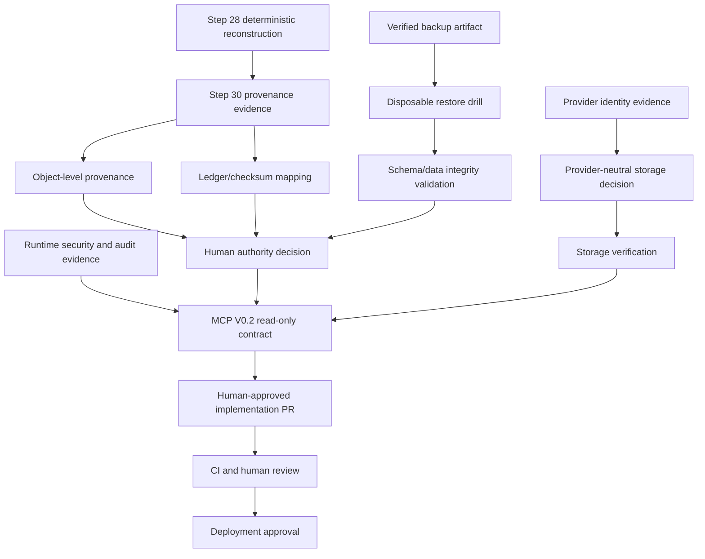

# SultraKita Step 31 — Dependency Graph and Safe Backlog

## Dependency Graph

## Safe Backlog

| ID | Dependency | Scope | Exit evidence | Mutation allowed |
|---|---|---|---|---|
| S31-01 | Step 30 reports | Review 36 production-only candidates | Signed object provenance matrix | No |
| S31-02 | S31-01 | Reconcile 30-entry ledger | Source/checksum/object mapping | No |
| S31-03 | Backup artifact | Disposable restore | Verified restore and integrity log | Disposable only |
| S31-04 | S31-03 | Rollback/recovery drill | Recovery record | Disposable only |
| S31-05 | Storage identity | Provider-neutral conformance design | Contract and test plan | No |
| S31-06 | Runtime security | MCP V0.2 read-only schemas | Auth, redaction, boundary tests | No |
| S31-07 | S31-01 through S31-06 | Human authority decision | Approved ADR | No |
| S31-08 | Approved ADR | Minimal implementation PR | CI, diff review, human review | Only approved non-production scope |

## Stop Rules

Any task that requires production SQL, migration, schema change, backup mutation, Cloudflare/R2 mutation, DNS, Vercel production modification, secret disclosure, MCP write access, merge, or deployment must stop and request human review.

**Step 32 is not executed automatically.**
